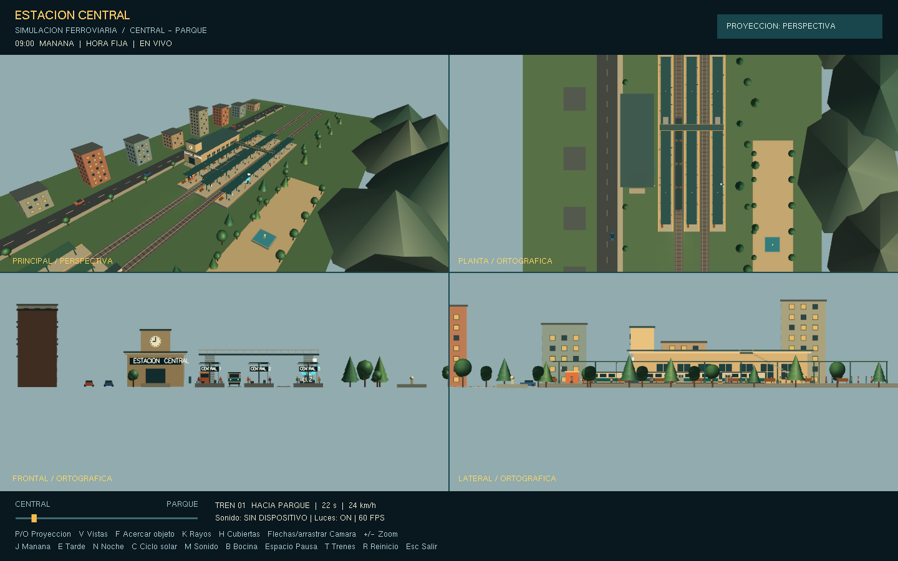

# Estación Central — simulación 3D en OpenGL

Proyecto para **Visual Studio, Windows y GLUT clásico**, con `#include <GL/glut.h>`. Usa OpenGL de función fija, siguiendo los métodos de la práctica de pirámides.



[Guion para exponer el proyecto](GUION_EXPOSICION.md) · [Vista nocturna](verificacion/04_noche.png) · [Laboratorio de luz](verificacion/06_rayos_lampara.png)

## Abrir y compilar

1. Cierra la versión anterior de la estación si está ejecutándose. Un ejecutable abierto puede producir LNK1168 al recompilar.
2. Abre `EstacionTren.sln`. Si Visual Studio pregunta por cambios externos, acepta recargar el proyecto.
3. Selecciona **Release / Win32** y **Compilar → Compilar solución** (`Ctrl+Mayús+B`).
4. Ejecuta con `Ctrl+F5`. La nueva versión se genera en `bin/Win32/Release/EstacionTren.exe`.

La configuración también admite Debug/Win32. Requiere el componente «Desarrollo para el escritorio con C++». El proyecto selecciona v143 para Visual Studio 2022 y v145 para Visual Studio 18, instalado en este equipo.

La biblioteca GLUT ya funcionó durante la compilación en este equipo. Para trasladar el proyecto, puedes colocar sus archivos de **32 bits** en:

```text
dependencias/include/GL/glut.h
dependencias/lib/Win32/glut32.lib
dependencias/bin/Win32/glut32.dll
```

La DLL se copia automáticamente al directorio del ejecutable si está en esa ubicación. El proyecto enlaza `opengl32.lib`, `glu32.lib`, `glut32.lib` y `winmm.lib`. Las bibliotecas de Windows proceden de su SDK; GLUT no se distribuye con este proyecto.

La configuración conserva `/SAFESEH:NO` en Win32 para la biblioteca GLUT clásica utilizada, que producía LNK2026/LNK1281. Esta opción desactiva SAFESEH para ese ejecutable. No mezcles GLUT x86 con un proyecto x64.

Si usas otro proyecto ya configurado, agrega **los tres archivos**: `estacion_tren.cpp`, `simulacion.h` y `sonido.h`; desactiva encabezados precompilados y evita tener dos funciones `main()`.

## Escena

- Estación Central: tres andenes, columnas, cubiertas, bancos, quiosco, máquinas de billetes, pasarela, escaleras y reloj.
- Estación Parque: segunda parada, dos andenes y edificio propio.
- Dos trenes de cuatro vagones, en vías independientes, con ruedas y puertas animadas.
- Recorrido de ida y vuelta: 27 segundos por trayecto, 9 segundos de parada. Aceleración y frenado suaves; las puertas se cierran antes de salir.
- 66 pasajeros en los andenes y pequeños grupos que simulan subir durante las paradas.
- Barrio con diez edificios, cinco autos, árboles, parque, fuente y colinas.
- Mañana, tarde y noche: cielo, orientación y color de la luz solar, ambiente, lámparas, ventanas y reloj. Un día simulado dura tres minutos.
- Sonido sintetizado: motor, ruedas, bocina, freno y ambiente diurno/nocturno. No requiere WAV o MP3 externos.

## Los nueve controles de la práctica

| Tecla | Control | Efecto |
|---|---|---|
| 1 | Rotación | Gira la pieza del laboratorio con `glRotatef`. |
| 2 | Escala (seno) | Cambia su tamaño periódicamente: `1 + 0.23 sin(2t)`, con `glScalef`. |
| 3 | Traslación (sen/cos) | Desplaza la pieza con funciones seno y coseno y `glTranslatef`. |
| 4 | Iluminación y normales | Activa/desactiva el cálculo de iluminación y la representación de normales de la esfera. |
| 5 | Luz de colores | Cambia las luces puntuales a rojo, verde y azul. |
| 6 | Cámara automática | Orbita la cámara alrededor del punto observado. |
| 7 | Proyección | Alterna perspectiva y ortográfica sin modificar la cámara. |
| 8 | Test de profundidad | Activa/desactiva `GL_DEPTH_TEST` para mostrar los errores de ocultamiento. |
| 9 | Viewports | Alterna una vista y cuatro vistas: principal, planta, frontal y lateral. |

Los controles **1, 2 y 3 actúan sobre la pieza del laboratorio**, no sobre toda la estación. Al usarlos, la cámara se acerca a esa pieza. Pueden combinarse. Las otras vistas de la opción 9 son ortográficas; la principal conserva la proyección elegida.

## Exploración y simulación

| Tecla / acción | Efecto |
|---|---|
| P / O | Elegir directamente perspectiva / ortográfica. |
| F | Acercamientos: tren → pasajeros → Parque → laboratorio → vista general. |
| K | Ir al laboratorio y mostrar rayos; una vez allí, alternar sus guías. |
| V | Encuadres: entorno completo → planta de Central → vista de vías → general. |
| Flechas / arrastrar con botón izquierdo | Girar y elevar la cámara. |
| + / - / rueda del ratón | Acercar o alejar. |
| W / A / S / D | Desplazar el punto observado por la escena. |
| H | Mostrar/ocultar cubiertas para ver mejor los pasajeros. |
| J / E / N | Mañana / tarde / noche; detienen el ciclo automático. |
| C | Activar/desactivar el ciclo solar. |
| L | Alternativa al control 4 de iluminación y normales. |
| M / B | Silenciar/activar sonido / tocar bocina. |
| Espacio | Pausar/reanudar movimiento y hora. La cámara manual sigue disponible. |
| T | Detener/reanudar solo los trenes. |
| ? | Mostrar/ocultar mensajes y menú de controles. |
| R / Esc | Reiniciar simulación / salir. |

## Cómo explicar las proyecciones

En **perspectiva**, el tamaño en pantalla depende de la profundidad. Los objetos iguales más lejanos se ven menores, y los rieles pueden converger hacia un punto de fuga. `gluPerspective(50, aspecto, 0.5, 1100)` configura esta proyección.

En **ortográfica**, la profundidad no reduce el tamaño: objetos iguales con igual orientación conservan sus dimensiones proyectadas. Los rieles paralelos se mantienen paralelos. Se utiliza `glOrtho(...)`.

Para una comparación clara, pausa con Espacio, deja desactivada la cámara automática y alterna P/O o 7. La cámara, los objetos y su tamaño real permanecen iguales. En ortográfica, el zoom se realiza cambiando el volumen de proyección; mover el ojo por sí solo no produciría la reducción por distancia propia de la perspectiva.

## Cómo explicar la luz

`configurarLuces()` establece una luz direccional para el sol/luz nocturna (`GL_LIGHT0`), seis luces puntuales con atenuación (`GL_LIGHT1`–`GL_LIGHT6`) y un foco que acompaña al tren (`GL_LIGHT7`). Las posiciones se configuran después de `gluLookAt()` para quedar vinculadas al mundo.

- **Ambiental:** ilumina de forma general sin una dirección concreta.
- **Difusa:** depende de la orientación de la superficie frente a la luz, mediante su normal.
- **Especular:** produce el brillo y depende del material, de la luz y del punto de vista.
- **Emisión:** hace visibles las bombillas y ventanas encendidas; por sí sola no ilumina otros objetos.

La esfera pulida muestra los brillos. En el laboratorio, el **amarillo** representa la luz incidente, el **cian** la normal perpendicular a la superficie y el **rosa** la dirección de reflexión ideal. Se calcula con `R = I - 2(I·N)N`, usando una normal unitaria. El punto de demostración se elige en el lado de la esfera orientado hacia la fuente.

Las flechas son una explicación geométrica, no un trazador de rayos. La escena calcula iluminación con OpenGL clásico por vértice; no implementa sombras proyectadas ni reflejos de la ciudad dentro de la esfera. Los planos se subdividen para que la iluminación puntual se aprecie y `GL_NORMALIZE` corrige la longitud de las normales después del escalado.

## Organización del código

| Archivo / método | Responsabilidad |
|---|---|
| `estacion_tren.cpp` | Geometría, dibujo, cámara, controles y mensajes. |
| `aplicarProyeccion()` | Selección `gluPerspective` / `glOrtho`. |
| `colocarCamara()` | Vista con `gluLookAt`. |
| `configurarLuces()` | Luces, ambiente, foco y atenuación. |
| `lamparasYVentanas()` | Materiales y transformaciones de la pieza didáctica. |
| `rayosDidacticos()` | Normales y reflexión vectorial. |
| `dibujarVista()` / `display()` | Renderización de uno o cuatro viewports. |
| `simulacion.h` | Recorrido, puertas, velocidad e interpolación del ciclo solar. |
| `sonido.h` | Síntesis PCM y reproducción con WinMM. |

El sonido usa buffers preparados y enviados con las APIs de Windows; se liberan al cerrar. Referencias: [waveOutOpen](https://learn.microsoft.com/en-us/windows/win32/api/mmeapi/nf-mmeapi-waveoutopen) y [Audio Data Blocks](https://learn.microsoft.com/en-us/windows/win32/multimedia/audio-data-blocks). Si no hay dispositivo, la simulación continúa e indica «SIN DISPOSITIVO».

## Verificación

La versión ampliada se compiló con MSBuild de Visual Studio 18 Community en Release/Win32. Se comprobaron:

- Continuidad del recorrido, posiciones de parada, frenado y puertas cerradas durante el viaje.
- Los nueve controles, conservación de cámara al cambiar proyección, horas y estados de pausa.
- Ley de reflexión y valores del ciclo de iluminación.
- Trece renderizados sin errores OpenGL, guardados en `verificacion/`.
- Apertura del dispositivo WinMM y envío de buffers; muestra WAV de tres segundos sin saturación. La salida por los altavoces no se evaluó auditivamente.

Opciones de comprobación: `--prueba-logica`, `--prueba-audio`, `--muestra-sonido` y `--verificar`. Las dos últimas guardan archivos en el directorio de trabajo.

Para presentar, sigue `GUION_EXPOSICION.md`.
